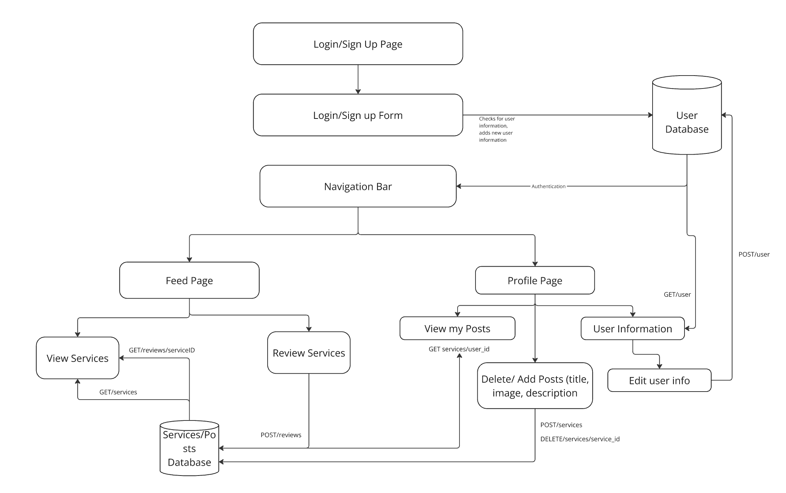
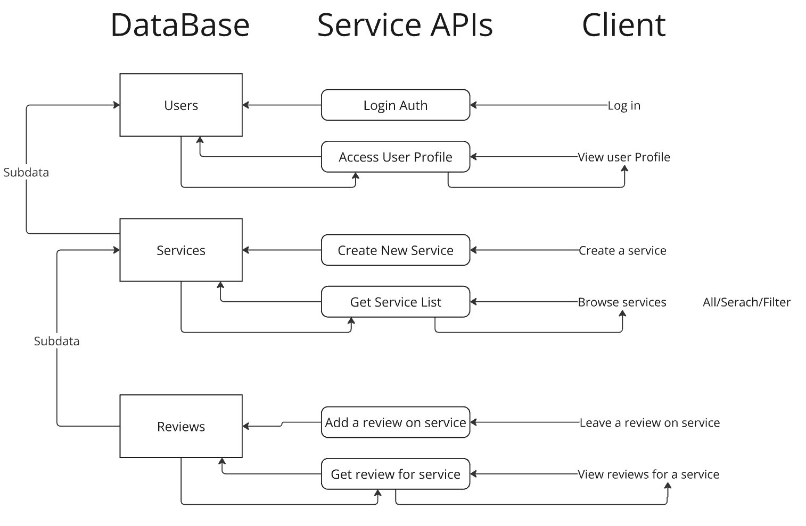

# GetService

By: Cleo Reyes, Ella Kim, Arushi Agarwal, Devanshi Desai

## [Check our live site here](https://uwservices-backend.onrender.com)

# Project Description

## Who is our target audience?

Our target audience consists of college students seeking unique, student-provided services, as well as student entrepreneurs looking to offer their skills and grow their businesses. Our platform aims to streamline this process by allowing service providers to easily showcase their offerings, whether it’s tutoring, nail services, keyboard building, or other specialized skills, while enabling service seekers to efficiently find and book what they need.

Beyond just connecting students, our goal is to create a safe, reliable, and community-driven marketplace where student entrepreneurs can establish their reputation, expand their reach, and gain real-world experience. To enhance engagement, our platform will integrate social features such as reviews, comments, posts, and messaging, making it more than just a marketplace, it’s a thriving ecosystem for student entrepreneurship.

## Why does our audience want to use our application?

College students often struggle to find affordable, high-quality services within their campus communities. Many specialized services are either unavailable nearby or come with high costs, forcing students to travel long distances or settle for expensive alternatives. Our platform provides a convenient and cost-effective solution by connecting them directly with fellow students who offer these services at competitive prices.

For student entrepreneurs, this application serves as a launchpad to showcase their skills, gain experience, and build a loyal customer base. By offering a structured yet flexible marketplace, we enable students to turn their passions into viable businesses while fostering a sense of community and mutual support.

## Why do we as developers want to build this application?

We, as developers, want to build this application because we see a gap in the market for a student-driven service marketplace that fosters entrepreneurship, affordability, and community support. Many college students have skills and talents they can monetize, but they lack an accessible platform to showcase their services and connect with potential customers.

By developing this application, we aim to empower students by providing them with opportunities to gain real-world experience, build their businesses, and expand their networks. We are passionate about creating a seamless, user-friendly platform that encourages collaboration and trust within college communities. Additionally, we see this as an opportunity to apply our technical skills in designing an intuitive, scalable, and secure platform that can make a meaningful impact on students' lives.

# Technical Description

## Architectural Diagrams



## Data Flow



## Summary Tables for User Stories

| Priority | User      | Description                                                       | Technical Implementation                                                              |
| -------- | --------- | ----------------------------------------------------------------- | ------------------------------------------------------------------------------------- |
| P0       | As a user | I want to be able to create an account and log into/out of it.    | Use Firebase Authentication to authenticate users and store their data in PostgreSQL. |
| P0       | As a user | I want to be able to post a service.                              | Store service details in the database, linking it to the user's ID.                   |
| P0       | As a user | I want to be able to leave reviews for services.                  | Store reviews in the database, ensuring they are linked to services and users.        |
| P1       | As a user | I want to be able to search and filter services.                  | Implement search and filtering queries in the database.                               |
| P1       | As a user | I want to be able to schedule appointments.                       | Implement a scheduling system that allows users to set available times.               |
| P1       | As a user | I want to be able to see service providers' locations on a map.   | Integrate Google Maps API for location-based service discovery.                       |
| P1       | As a user | I want to be able to favorite/bookmark services.                  | Store bookmarked services in a separate table for quick access.                       |
| P1       | As a user | I want to receive notifications when a service provider responds. | Implement real-time notifications using WebSockets or Firebase Cloud Messaging.       |
| P2       | As a user | I want to be able to message service providers.                   | Store messages in the messages table with sender and receiver IDs.                    |
| P2       | As a user | I want to be able to verify my identity as a service provider.    | Implement an optional verification process to build trust.                            |
| P2       | As a user | I want to see analytics on my posted services.                    | Display statistics such as views, clicks, and engagement rates.                       |
| P2       | As a user | I want to be able to share service listings on social media.      | Provide sharing options through social media integration.                             |

## API Endpoints:

| Method | Endpoint             | Description                     |
| ------ | -------------------- | ------------------------------- |
| POST   | /auth/register       | Registers a new user            |
| POST   | /auth/login          | Authenticates user              |
| GET    | /services            | Fetches all service listings    |
| POST   | /services            | Creates a new service listing   |
| GET    | /services/:id        | Fetches details of a service    |
| PUT    | /services/:id        | Updates a service listing       |
| DELETE | /services/:id        | Deletes a service listing       |
| POST   | /reviews             | Submits a review                |
| GET    | /reviews/:service_id | Retrieves reviews for a service |

## Database Schemas:

```sql
CREATE TABLE users (
    id SERIAL PRIMARY KEY,
    name VARCHAR(255),
    profile_picture TEXT,
    email TEXT,
    phone_number TEXT,
    bio TEXT
);

CREATE TABLE services (
    id SERIAL PRIMARY KEY,
    user_id INT REFERENCES users(id),
    title VARCHAR(255),
    description TEXT,
    price DECIMAL,
    category VARCHAR(100),
    location TEXT,
    created_at TIMESTAMP DEFAULT NOW()
);

CREATE TABLE reviews (
    id SERIAL PRIMARY KEY,
    service_id INT REFERENCES services(id),
    user_id INT REFERENCES users(id),
    rating INT CHECK (rating BETWEEN 1 AND 5),
    comment TEXT,
    created_at TIMESTAMP DEFAULT NOW()
);

CREATE TABLE bookmarks (
    id SERIAL PRIMARY KEY
);
```

# How to run

To run server:
``
cd server
npm run dev
``

To run client:
``
cd client
npm start
``
